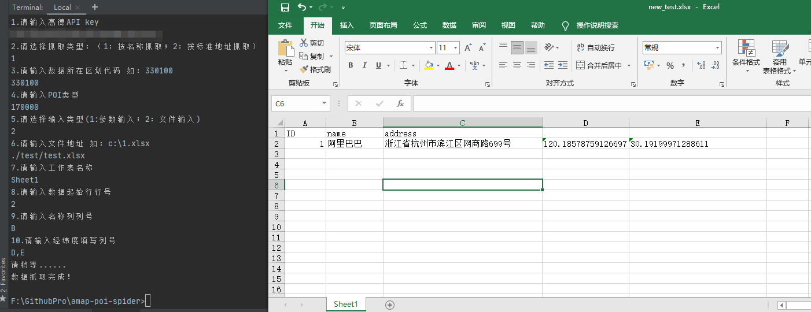
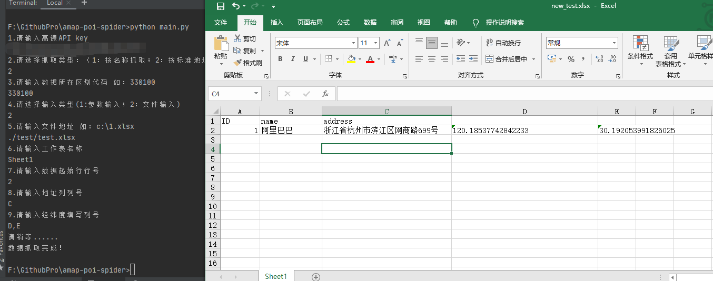
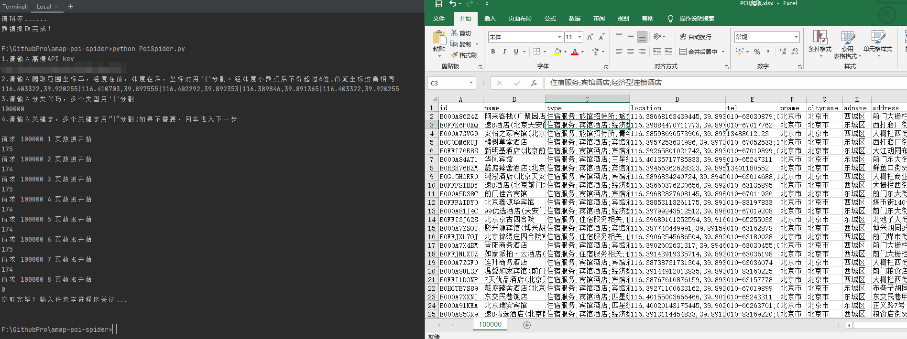

# Welcome to amap-poi-spider

[](https://github.com/gisShield/amap-poi-spider/blob/main/LICENSE)  [](https://www.python.org/)    [](https://darkgis.top/)

## 一、功能描述

> 基于高德地图API 实现以下三个功能：
>
> - 根据POI名称获取坐标
> - 根据POI标准地址获取坐标
> - 根据多边形范围获取POI信息
>
> 获得的所有坐标均已经进行转换为WGS84坐标

## 二、成果截图

1. 根据POI名称查询

   

2. 根据POI标准地址查询

   

3. 根据多边形范围查询

   

## 三、使用步骤

1. 安装依赖

   ```bash
   pip install -r requirements.txt
   ```

2. 执行对应python

   ```bash
   # 根据POI名称查询 （抓取类型选择1）;根据POI标准地址查询(抓取类型选择2)
   python main.py 
   
   # 根据多边形范围查询
   python PoiSpider.py
   ```

3. 按照要求填入参数

   - 根据POI名称查询 和 根据POI标准地址查询

   | 参数名        | 备注                                                         |
   | ------------- | ------------------------------------------------------------ |
   | 高德API Key   | 可以通过注册高德开发者账号获得，可参考 [高德开放平台：如何申请Key](https://lbs.amap.com/faq/quota-key/key/39669) |
   | 区划代码      | 可参考高德官方提供代码表：[城市编码表](https://a.amap.com/lbs/static/amap_3dmap_lite/AMap_adcode_citycode.zip) |
   | POI类型       | 可参考高德官方提供代码：[POI分类编码](https://a.amap.com/lbs/static/amap_poicode.xlsx.zip) |
   | 文件地址      | 需要爬取的Excel文件的磁盘路径，支持绝对和相对路径，文件只支持 `.xlsx`后缀的文件 |
   | 工作表名称    | 需要爬取的Excel文件中工作表的名称                            |
   | 起始行号      | Excel文件中去除表头后有效数据行的开始行号                    |
   | 地址列/名称列 | Excel文件中存放地址一列或者名称一列的列号                    |
   | 经纬度填写列  | Excel文件中存放爬取结果的列号，输入一个列号，经纬度则按照`x,y`的形式拼接填写；如果输入两列，经度纬度各占一列进行填写 |

   - 根据多边形范围查询

   | 参数名         | 备注                                                         |
   | -------------- | ------------------------------------------------------------ |
   | 高德API Key    | 可以通过注册高德开发者账号获得，可参考 [高德开放平台：如何申请Key](https://lbs.amap.com/faq/quota-key/key/39669) |
   | 爬取范围坐标串 | 经度和纬度用","分割，经度在前，纬度在后，坐标对用"\|"分割。经纬度小数点后不得超过6位。     多边形为矩形时，可传入左上右下两顶点坐标对；其他情况下首尾坐标对需相同 |
   | 分类代码       | 可参考高德官方提供代码：[POI分类编码](https://a.amap.com/lbs/static/amap_poicode.xlsx.zip)，多个类型用“\|”分割； |
   | 关键字         | 多个关键字用“\|”分割                                         |

4. 去对应文件夹中找到相关结果

   - 根据POI名称查询 和 根据POI标准地址查询：如果选择的是**参数输入**，可以直接去源码根目录下`logs/poi-main.log`查看；如果选择的是**文件输入** 会新生成一个`new_+源文件名`的Excel文件，保存在与源文件同级目录下
   - 根据多边形范围查询：源码根目录下会生成一个`POI爬取.xlsx`

## 四、作者

- GitHub：[gisShield](https://github.com/gisShield)
- Blog：[凌往昔GIS](https://darkgis.top/)
- CSDN：[凌往昔](https://blog.csdn.net/u013420816)

## 

## 